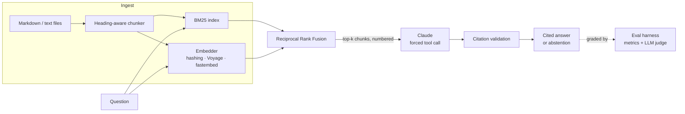

# Groundwork: grounded, cited, measurable RAG

[](https://github.com/Shoaibmoiz77/Gen-AI-Project-Capstone-/actions/workflows/ci.yml)


A retrieval-augmented question answering system that answers **only** from your documents,
cites a source for **every sentence**, says **"I don't know"** when the documents don't
contain the answer, and ships with an **evaluation harness** that measures all three.

Most RAG demos stop at "it returned something plausible." This project treats a RAG system as
something you measure and improve: every design decision below comes with a metric that tells
you whether it worked.

```
# illustrative output
$ groundwork ask "I left my work laptop on a train. What should I do?"
Report the lost device to the security team within 1 hour, by posting in #security-help or
emailing security@northwind.example. [1] The device will then be remotely wiped. [1]
  [1] Information Security Policy > Devices  (security-policy#3)
```

## Highlights

| | |
|---|---|
| **Hybrid retrieval** | BM25 (implemented from scratch) and dense embeddings, merged with Reciprocal Rank Fusion |
| **Structure-aware chunking** | Markdown is split by headings; each chunk carries its heading path ("Expense Policy > Travel") into the index |
| **Sentence-level citations** | Claude returns structured output via a forced tool call: each sentence plus the ids of the sources that support it. Invalid ids are dropped and counted |
| **First-class abstention** | `answerable: false` is part of the output schema, and abstention accuracy is a tracked metric |
| **Evaluation harness** | Recall@k, MRR, citation precision, unsupported-sentence rate, LLM-as-judge faithfulness and correctness, latency, token usage |
| **Retrieval ablation** | BM25 vs dense vs hybrid on the same questions, on every run |
| **CI quality gate** | GitHub Actions fails the build if retrieval recall drops below a threshold, with no API key needed |
| **Production shape** | FastAPI service, demo UI, Docker image, typed config, 28 tests that run offline |

## Architecture



## Quickstart

```bash
git clone https://github.com/Shoaibmoiz77/Gen-AI-Project-Capstone-.git
cd Gen-AI-Project-Capstone-
python -m venv .venv && source .venv/bin/activate
pip install -e ".[dev]"

cp .env.example .env            # add your ANTHROPIC_API_KEY
export $(grep -v '^#' .env | xargs)

groundwork ingest                                  # index data/corpus
groundwork ask "What's the hotel limit in London?" # cited answer in the terminal
groundwork serve                                   # API + demo UI at http://127.0.0.1:8000
```

**No API key?** Everything still runs. Without `ANTHROPIC_API_KEY` the system falls back to a
deterministic extractive baseline (`FakeLLM`), so you can explore retrieval, the API, the UI and
the eval harness offline. `pytest` never touches the network.

**Docker:**

```bash
docker build -t groundwork-rag .
docker run --rm -p 8000:8000 -e ANTHROPIC_API_KEY groundwork-rag
```

## Evaluation

The golden set (`data/eval/golden.jsonl`) has 34 questions over a fictional company handbook:
direct lookups, paraphrased questions that share few words with the source, multi-document
questions, and 5 **unanswerable** questions that test whether the system invents answers.

```bash
make eval           # Claude as generator and judge  -> reports/latest/report.md
make eval-offline   # no API key: extractive baseline -> reports/offline-baseline/report.md
```

Each run writes `report.md` (human readable, includes a failure analysis), `results.json`
(for CI gates and dashboards) and `cases.jsonl` (one row per question for debugging).

### What's measured, and why

| Metric | Question it answers | Failure it catches |
|---|---|---|
| Recall@k, MRR | Did retrieval surface the right documents, and how high? | Bad chunking, weak queries, wrong embedder |
| Citation precision | Do citations point to the right documents? | Model citing whatever was nearby |
| Unsupported sentence rate | Does any sentence lack a valid citation? | Ungrounded filler, invented citation ids |
| Faithfulness (LLM judge) | Is every claim backed by the cited text? | Hallucination |
| Correctness (LLM judge) | Does the answer match the reference? | Right sources, wrong conclusion |
| Abstention accuracy | Does it say "I don't know" on unanswerable questions? | Confident invention |
| Answer rate | Does it answer when it can? | Over-cautious refusal |

Faithfulness and correctness are scored **separately** on purpose. An answer can be faithful but
wrong (it cited the wrong policy accurately) or correct but unfaithful (the model knew the answer
and cited something irrelevant). The first means fix retrieval; the second means fix the prompt.

### Results

**Offline baseline** (extractive `FakeLLM`, hashing embedder). This is the floor any real model
has to beat. Full report: [`reports/offline-baseline/report.md`](reports/offline-baseline/report.md).

| Metric | Extractive baseline | Claude |
|---|---|---|
| Retrieval recall@6 | 100.0% | *run `make eval`* |
| Retrieval MRR | 0.97 | |
| Answer rate | 65.5% | |
| Abstention accuracy | 40.0% | |
| Citation precision | 94.7% | |
| Judge correctness (1-5) | 3.58 | |

> Run `make eval` with your API key and paste the Claude column in. The point of the harness is
> that the numbers in this README come from a command anyone can rerun.

**Retrieval ablation** (same 29 answerable questions, no LLM):

| Mode | Recall@1 | Recall@3 | MRR |
|---|---|---|---|
| BM25 | 94.8% | 100.0% | 0.98 |
| Dense (hashing embedder) | 84.5% | 96.6% | 0.93 |
| Hybrid (RRF) | 91.4% | 100.0% | 0.97 |

**What this shows:** with the zero-dependency hashing embedder, hybrid does *not* beat BM25 on this
corpus, because the "dense" side is lexical too and adds noise rather than new signal. That's
the reason the embedder is pluggable: set `GROUNDWORK_EMBEDDER=voyage` (or `fastembed`) to get a
semantic signal, rerun the ablation, and check whether the paraphrase questions improve. Deciding
from measurements instead of assuming "hybrid is always better" is what the harness is for.

## API

| Method | Path | Body | Returns |
|---|---|---|---|
| `POST` | `/ask` | `{"question": "...", "k": 6}` | answer, cited sentences, sources, timing, token usage |
| `POST` | `/search` | `{"query": "...", "k": 6, "mode": "hybrid"}` | ranked chunks (no LLM call) |
| `GET` | `/health` | | index size, embedder, model |
| `GET` | `/` | | demo UI with clickable citations |

Interactive docs at `/docs`.

## Project layout

```
src/groundwork/
  chunking.py      heading-aware chunker
  bm25.py          Okapi BM25 from scratch
  embeddings.py    hashing / Voyage / fastembed behind one interface
  retrieval.py     hybrid search + RRF + index persistence
  llm.py           Anthropic client (forced tool calls) + deterministic FakeLLM
  generation.py    prompt, answer schema, citation validation
  pipeline.py      retrieve -> generate
  api.py           FastAPI service + demo UI
  cli.py           ingest / ask / eval / serve
  evals/           metrics, LLM judge, runner, report
data/corpus/       sample documents (fictional company)
data/eval/         golden question set
tests/             28 offline tests
```

## Design decisions

- **Forced tool calls instead of parsing prose.** The answer schema *is* the output contract.
  No regex over model output, no "please respond in JSON" hoping for the best.
- **Short integer source ids in the prompt**, mapped back to chunk ids afterwards. They're
  cheaper to emit and harder to garble than `expense-policy#7`.
- **RRF over score blending.** BM25 scores are unbounded and cosine scores live in [-1, 1];
  adding them needs per-corpus tuning. RRF only uses ranks.
- **Sources are data, not instructions.** The system prompt tells the model to ignore
  instructions inside retrieved text, a basic defense against prompt injection via documents.
- **A test that checks every request argument against the installed SDK's signature**, so an
  SDK upgrade that removes a parameter fails in CI instead of in front of a user.
- **A fake model that speaks the real protocol.** Tests exercise the actual parsing and
  validation code paths, and the offline baseline gives a floor to compare against.

## Using your own documents

```bash
groundwork ingest --src path/to/your/docs   # .md and .txt
groundwork serve
```

To evaluate on your own data, write a `golden.jsonl` in the same format and pass
`--golden path/to/golden.jsonl`.

## Roadmap

- Reranking stage (cross-encoder or Claude) between fusion and generation, measured by the ablation
- Streaming responses in the API and UI
- Prompt caching for the system prompt and frequently retrieved chunks
- PDF ingestion
- Track eval history over time to catch regressions across prompt and model changes

## License

MIT. The sample corpus describes a fictional company and is free to reuse.
